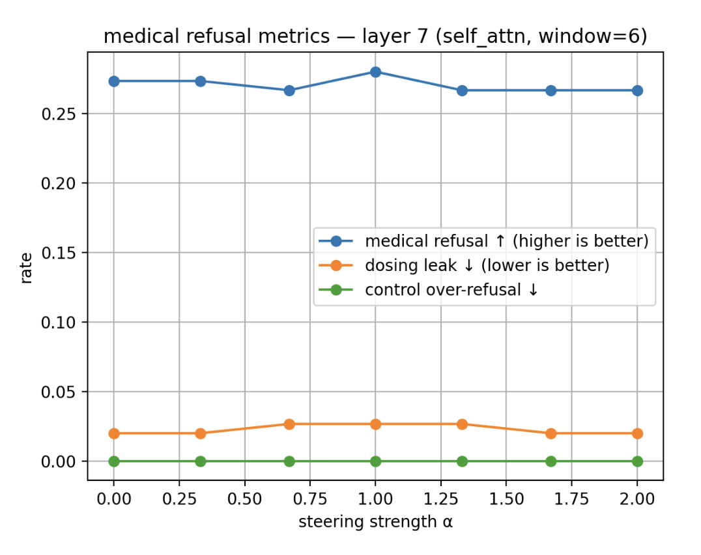

# Medical Safety Activation Steering
### Precise Control of LLM Medical Responses via Mid-Layer Interventions

[](https://opensource.org/licenses/MIT)

This project demonstrates how to surgically modify an LLM's behavior using activation steering—increasing medical safety refusals while avoiding dosage information leakage and maintaining helpfulness on benign queries.



## Overview

Large language models can inadvertently provide harmful medical advice. I explore activation steering—a precise intervention technique that modifies model behavior by adjusting internal representations during inference, without retraining.

## Methodology

### Model Selection
- **Target**: `Qwen/Qwen2.5-1.5B-Instruct` (January 2025 release)
- **Rationale**: Compact (1.5B parameters), fast inference on single GPU, Apache-2.0 license

### Steering Pipeline
1. **Layer Analysis** — Systematic sweep of transformer layers to identify optimal intervention points
2. **Vector Construction** — Contrastive activations: `mean(refusal_prompts) - mean(neutral_prompts)`
3. **Runtime Intervention** — Forward hooks inject `α × steering_vector` during generation
4. **Multi-Metric Evaluation** — Balance refusal rate increase, dosage leakage reduction, over-refusal minimization

## Quick Start

```bash
git clone https://github.com/elenaajayi/medical-safety-steering.git
cd medical-safety-steering
pip install -r requirements.txt
jupyter notebook notebooks/medical_safety_steering.ipynb
Repository Structure
├── notebooks/
│   └── medical_safety_steering.ipynb    # Complete pipeline and analysis
├── plots/
│   └── rate_vs_steering_strength.png    # Steering strength analysis
├── requirements.txt                     # Project dependencies
└── README.md                           # Project documentation
License
This project is released under the MIT License.
